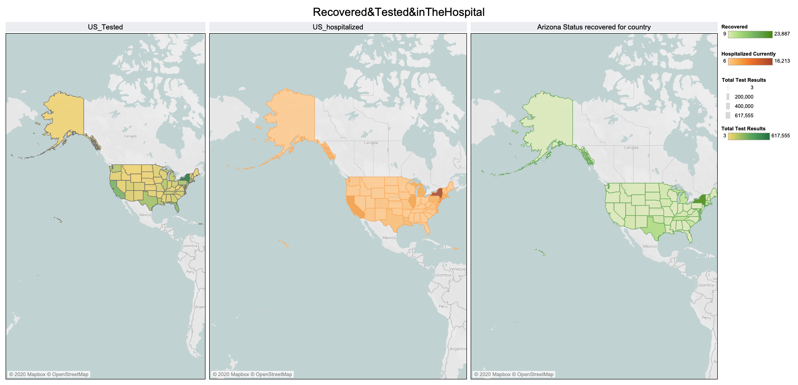

# VisualSARS2Graph

This project worked was build with tableau desktop and python.

# COVID19 US

## AVRG temperature with number cases for each country.

## People Recovered & Tested & hospidalizate in this moment

# Dataset used

Look inside the submodule dir to found some data and in addition, you can found an description of dataset [here](data/README.md)

# Author

I developed this project because I'm learning about the data analyctics.

P.S: At this moment I'm developing other chart, if you want see any chart you can open an issue to talk about it.

# Important

This graph are build with data open source and withoud **NO** check by doctor or specialist about covid19. Please pay attentiona and if you want use this chart, you should be **TEST** this data.

# License

 This work is licensed under a <a rel="license" href="http://creativecommons.org/licenses/by/4.0/">Creative Commons Attribution 4.0 International License</a>.