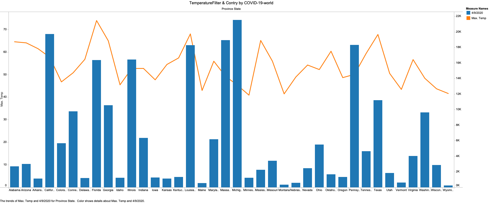

# VisualSARS2Chart

This project contains some chart about #COVID-19 in the world, these charts are built with tableau desktop and the datasets are cleaning with python
you can find the script in [this direcotry](src/pyvcs-filter).

# COVID19 US

## AVRG temperature with number of cases for each country.

## People Recovered & Tested & hospitalize at this moment

# Dataset used

Look inside the submodule dir to found some data and in addition, you can found a description of the dataset [here](data/README.md)

# Author

I developed this project because I'm learning about data analytics and is a very interesting build chart on #COVID-19 because it helps to stay updated with the world.

P.S: At this moment I'm developing other charts if you want see any chart you can open an issue to talk about it.

Thanks and stay safe.

# Important

These charts are built with open-source data and **without** check by doctor or specialist about covid19. Please pay attention and if you want to use this chart, you should **TEST** these datasets and charts.

# License

 This work is licensed under a <a rel="license" href="http://creativecommons.org/licenses/by/4.0/">Creative Commons Attribution 4.0 International License</a>.